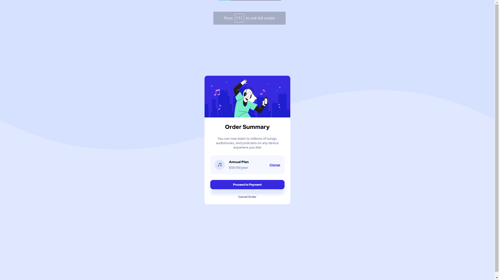

# URL of the solution: [Very cool solution](https://qirele.github.io/frontend-challenges/orderSummary/)

# [Author](https://www.frontendmentor.io/profile/qirele)

### Built with

- Semantic HTML5 markup
- CSS custom properties
- Flexbox

### Screenshot

# Frontend Mentor - Order summary card solution

This is a solution to the [Order summary card challenge on Frontend Mentor](https://www.frontendmentor.io/challenges/order-summary-component-QlPmajDUj). Frontend Mentor challenges help you improve your coding skills by building realistic projects. 
