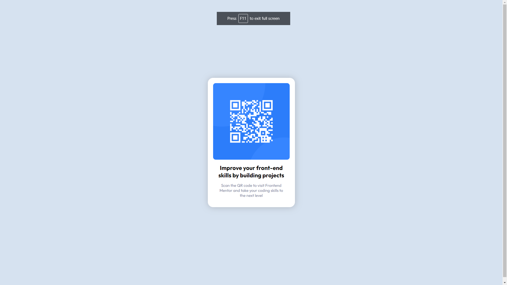

# URL of the solution: [Very cool solution](https://qirele.github.io/frontend-challenges/qrCode/)

### Built with

- Semantic HTML5 markup
- CSS custom properties
- Flexbox

### Screenshot

### Frontend Mentor - QR code component solution

This is a solution to the [QR code component challenge on Frontend Mentor](https://www.frontendmentor.io/challenges/qr-code-component-iux_sIO_H). Frontend Mentor challenges help you improve your coding skills by building realistic projects. 
