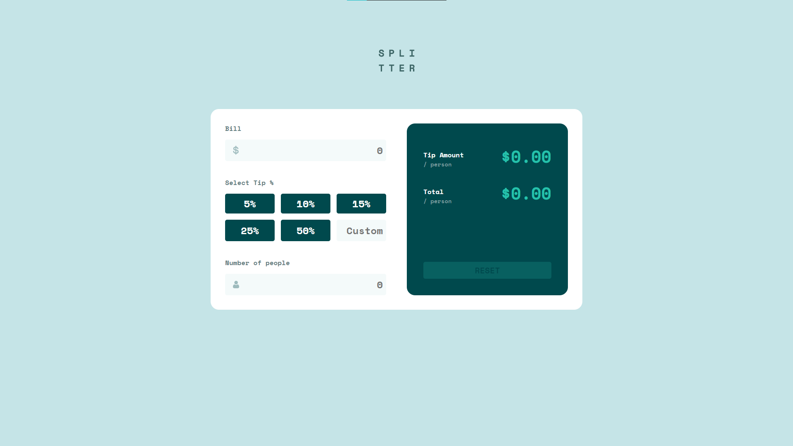

# Frontend Mentor - Tip calculator app solution

This is a solution to the [Tip calculator app challenge on Frontend Mentor](https://www.frontendmentor.io/challenges/tip-calculator-app-ugJNGbJUX).

## Table of contents

- [Overview](#overview)
  - [The challenge](#the-challenge)
  - [Screenshot](#screenshot)
  - [Links](#links)
- [My process](#my-process)
  - [Built with](#built-with)
  - [What I learned](#what-i-learned)
- [Author](#author)

## Overview

### The challenge

Users should be able to:

- View the optimal layout for the app depending on their device's screen size
- See hover states for all interactive elements on the page
- Calculate the correct tip and total cost of the bill per person

### Screenshot

### Links

- Solution URL: [github repo](https://github.com/qirele/frontend-challenges/tree/master/tip-calculator)
- Live Site URL: [website](https://qirele.github.io/frontend-challenges/tip-calculator/)

## My process

### Built with

- Semantic HTML5 markup
- CSS custom properties
- Flexbox
- CSS Grid
- Mobile-first workflow

### Acknowledgments

Shout out to my dude on stackoverflow who commented this:

> "To exclude zero value (e.g 0, 0.00, 0.00000, 00.00), use this modified regex: ^(?=.+)(?:[1-9]\d*)?(?:(\.\d+)|(0\.\d*[1-9]+\d*))?$"

Truly a legend, 
[link to comment](https://stackoverflow.com/questions/6029674/regex-for-positive-float-numbers#comment122354192_6029817)
